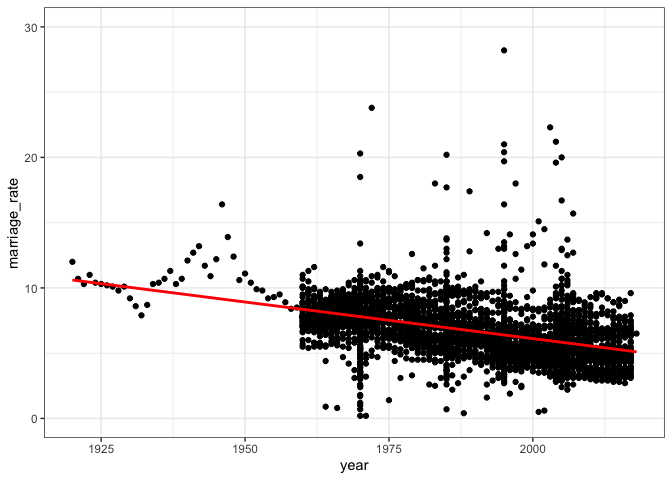

(W5) data visualization
================
Elisa Simon
2022-08-31

# Marriage rate per 1000 habitants

(Dataset source: Ortiz-Ospina and Roser (2020))

    ## # A tibble: 6 × 4
    ##   entity  code   year marriage_rate
    ##   <chr>   <chr> <dbl>         <dbl>
    ## 1 Albania ALB    1960           7.8
    ## 2 Albania ALB    1961          11.3
    ## 3 Albania ALB    1962           7.5
    ## 4 Albania ALB    1963           7.5
    ## 5 Albania ALB    1964           7.2
    ## 6 Albania ALB    1965           7.5

## Description of content and data types

| Variable name     |         **Description**          | **R data type** | **Statistical data**  |
|-------------------|:--------------------------------:|:---------------:|:---------------------:|
| **Entity**        |      represents the country      |    character    | qualitative nominale  |
| **Code**          |       code for the country       |    character    | qualitative nominale  |
| **Year**          |               year               |     numeric     | quantitative discrete |
| **Marriage rate** | marriage rate per 1000 habitants |     numeric     | quantitative discrete |

## Wide/long transformation

The marriage data set is in long format.

    ## # A tibble: 6 × 101
    ##   entity    code  `1920` `1921` `1922` `1923` `1924` `1925` `1926` `1927` `1928`
    ##   <chr>     <chr>  <dbl>  <dbl>  <dbl>  <dbl>  <dbl>  <dbl>  <dbl>  <dbl>  <dbl>
    ## 1 Albania   ALB       NA     NA     NA     NA     NA     NA     NA     NA     NA
    ## 2 Algeria   DZA       NA     NA     NA     NA     NA     NA     NA     NA     NA
    ## 3 American… ASM       NA     NA     NA     NA     NA     NA     NA     NA     NA
    ## 4 Andorra   AND       NA     NA     NA     NA     NA     NA     NA     NA     NA
    ## 5 Angola    AGO       NA     NA     NA     NA     NA     NA     NA     NA     NA
    ## 6 Anguilla  AIA       NA     NA     NA     NA     NA     NA     NA     NA     NA
    ## # … with 90 more variables: 1929 <dbl>, 1930 <dbl>, 1931 <dbl>, 1932 <dbl>,
    ## #   1933 <dbl>, 1934 <dbl>, 1935 <dbl>, 1936 <dbl>, 1937 <dbl>, 1938 <dbl>,
    ## #   1939 <dbl>, 1940 <dbl>, 1941 <dbl>, 1942 <dbl>, 1943 <dbl>, 1944 <dbl>,
    ## #   1945 <dbl>, 1946 <dbl>, 1947 <dbl>, 1948 <dbl>, 1949 <dbl>, 1950 <dbl>,
    ## #   1951 <dbl>, 1952 <dbl>, 1953 <dbl>, 1954 <dbl>, 1955 <dbl>, 1956 <dbl>,
    ## #   1957 <dbl>, 1958 <dbl>, 1959 <dbl>, 1960 <dbl>, 1961 <dbl>, 1962 <dbl>,
    ## #   1963 <dbl>, 1964 <dbl>, 1965 <dbl>, 1966 <dbl>, 1967 <dbl>, 1968 <dbl>, …

## Data in tidy format ?

Data are tidy (in the original long format) I additionally removed the
‘code’ column as it was redondant.

    ## # A tibble: 6 × 3
    ##   entity   year marriage_rate
    ##   <chr>   <dbl>         <dbl>
    ## 1 Albania  1960           7.8
    ## 2 Albania  1961          11.3
    ## 3 Albania  1962           7.5
    ## 4 Albania  1963           7.5
    ## 5 Albania  1964           7.2
    ## 6 Albania  1965           7.5

## Separate and unite

The data set I choose is not really pertinent to do so. Therefore, I
decided to first unit the entity and code variables and then to separate
them again.

    ## # A tibble: 6 × 3
    ##   Codentity     year marriage_rate
    ##   <chr>        <dbl>         <dbl>
    ## 1 Albania, ALB  1960           7.8
    ## 2 Albania, ALB  1961          11.3
    ## 3 Albania, ALB  1962           7.5
    ## 4 Albania, ALB  1963           7.5
    ## 5 Albania, ALB  1964           7.2
    ## 6 Albania, ALB  1965           7.5

    ## # A tibble: 6 × 4
    ##   entity  code   year marriage_rate
    ##   <chr>   <chr> <dbl>         <dbl>
    ## 1 Albania ALB    1960           7.8
    ## 2 Albania ALB    1961          11.3
    ## 3 Albania ALB    1962           7.5
    ## 4 Albania ALB    1963           7.5
    ## 5 Albania ALB    1964           7.2
    ## 6 Albania ALB    1965           7.5

## Create a plot

``` r
ggplot(marriage_clean, aes(year, marriage_rate)) +
  geom_point() +
  geom_smooth(method=lm, color= "red", se=FALSE) +
  theme_bw() +
  coord_cartesian (ylim= c(0, 30))
```

    ## `geom_smooth()` using formula 'y ~ x'

<!-- -->

# References

<div id="refs" class="references csl-bib-body hanging-indent">

<div id="ref-ortiz-ospina_marriages_2020" class="csl-entry">

Ortiz-Ospina, Esteban, and Max Roser. 2020. “Marriages and Divorces.”
*Our World in Data*.
<https://ourworldindata.org/marriages-and-divorces>.

</div>

</div>
