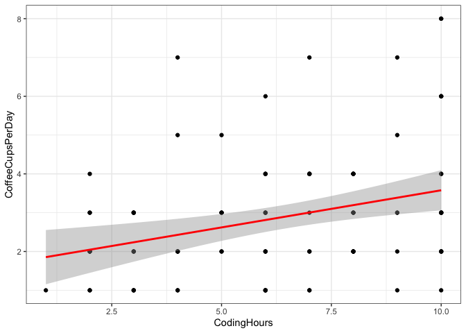

(W6) data visualization
================
Elisa Simon
2022-08-31

# Of code and coffee

This data set contains data about coffee consumption and coding habits
(source: NajElKotob (2018))

## Variables description

    ## # A tibble: 6 × 9
    ##   CodingHours CoffeeCupsPerDay CoffeeTime    CodingWithoutCoffee CoffeeType 
    ##         <dbl>            <dbl> <chr>         <chr>               <chr>      
    ## 1           8                2 Before coding Yes                 Caffè latte
    ## 2           3                2 Before coding Yes                 Americano  
    ## 3           5                3 While coding  No                  Nescafe    
    ## 4           8                2 Before coding No                  Nescafe    
    ## 5          10                3 While coding  Sometimes           Turkish    
    ## 6           8                2 While coding  Sometimes           Nescafe    
    ## # … with 4 more variables: CoffeeSolveBugs <chr>, Gender <chr>, Country <chr>,
    ## #   AgeRange <chr>

| Variable names      |                         **Description**                         | **R data type** | **Statistical data type** |
|---------------------|:---------------------------------------------------------------:|:---------------:|:-------------------------:|
| CodingHours         |                     time spend coding a day                     |     numeric     |   quantitative discrete   |
| CoffeeCupsPerDay    |                 number of cups of coffee a day                  |     numeric     |   quantitative discrete   |
| CoffeeTime          |       when the coffee is enjoyed (before or while coding)       |    character    |    qualitative nominal    |
| CodingWithoutCoffee | does it happens to the subject not to drink coffee while coding |    character    |    qualitative ordinal    |
| CoffeeType          |                          coffee brand                           |    character    |    qualitative nominal    |
| CoffeeSolveBugs     |                 does coffee help to solve bugs                  |    character    |    qualitative ordinal    |
| Gender              |                    gender of the individual                     |    character    |    qualitative nominal    |
| Country             |                             country                             |    character    |    qualitative nominal    |
| AgeRange            |                   age range of the individual                   |    character    |    qualitative ordinal    |

## Two questions

1.  Is there a relationship between the time spend coding and the number
    of cups of coffee ?

2.  Is there a relationship between the time spend coding and the coffee
    brand ?

## Visualization (1) : Coffee Cups and Coding Hours

Here I want to see whether there is a correlation between the variables
CodingHours and CoffeeCupsPerDay. Therefore, I used a **scatter plot**.

    ## `geom_smooth()` using formula 'y ~ x'

<!-- -->

## Visualization (2): Coffee Brand and Coding Hours

<!-- -->

# References

NajElKotob. 2018. “Coffee And Code.”
<https://github.com/NajiElKotob/Awesome-Power-BI/blob/master/Datasets/CoffeeAndCodeLT2018.csv>.

