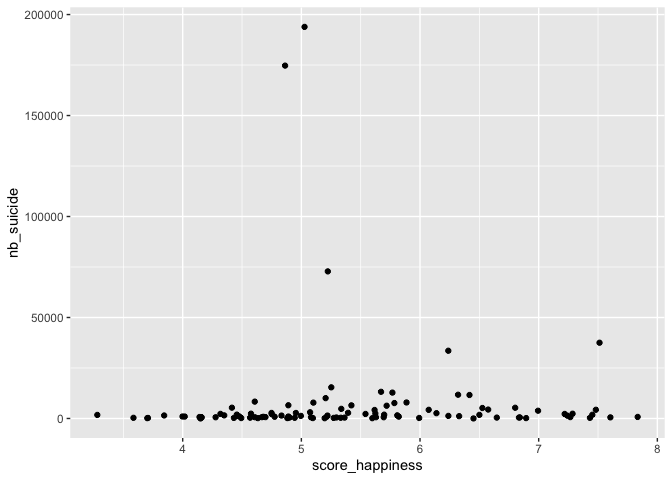
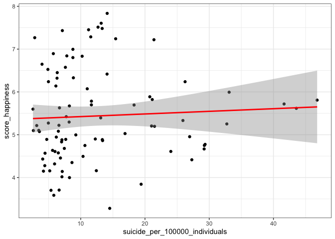

(W7) data modeling
================
Elisa Simon
2022-08-31

# Dataset: Suicide and Happiness

## Data description

This dataset contains data found in Ortiz-Ospina and Roser (2013) and
Ritchie, Roser, and Ortiz-Ospina (2014). The data set contains 101
observations of 3 variables.

``` r
head(df)
```

    ##       entity score_happiness nb_suicide
    ## 1    Albania        4.634252        169
    ## 2  Argentina        6.073158       4283
    ## 3    Armenia        4.881516        211
    ## 4  Australia        7.285391       2358
    ## 5 Azerbaijan        4.568160        373
    ## 6 Bangladesh        4.607322       8341

Here’s a brief description of the variables.

| Variable name       |        **Description**        | **R data type** | **Statistical data**  |
|---------------------|:-----------------------------:|:---------------:|:---------------------:|
| **entity**          |            country            |    character    |  qualitative nominal  |
| **nb_suicide**      | number of deaths by self-harm |     numeric     | quantitative continue |
| **score_happiness** |    life satisfaction score    |     numeric     | quantitative continue |

## Data visualization

So, I tried to visualize, but the problem is we should actually have
kind of a suicide rate for each countries, rather than the actual
number. <!-- -->

## Back to the data

So… I download a data set with the population of each country (source:
[data.worldbank.org](https://data.worldbank.org/indicator/SP.POP.TOTL?end=2021&start=1960%20#ref)
), and do some merging stuff again.

    ##       entity score_happiness suicide_per_100000_individuals
    ## 1    Albania        4.634252                       5.611846
    ## 2  Argentina        6.073158                      11.012286
    ## 3    Armenia        4.881516                       7.077540
    ## 4  Australia        7.285391                      11.561771
    ## 5 Azerbaijan        4.568160                       4.444789
    ## 6 Bangladesh        4.607322                       5.999187

## Let’s try visuailzation again

Well, whether I’ve been doing something wrong, whether there is no
appearent correlation between the score of life satisfaction and the
number of suicide for 100’000 individuals.

    ## `geom_smooth()` using formula 'y ~ x'

<!-- -->

# Hypothesis

H1: There is a negative correlation between the happiness score and the
suicide rates.

## Statistical test

To know whether there is a correlation between the two variables, I run
a Pearson’s correlation test.

    ## 
    ##  Pearson's product-moment correlation
    ## 
    ## data:  df_shp$score_happiness and df_shp$suicide_per_100000_individuals
    ## t = 0.51356, df = 89, p-value = 0.6088
    ## alternative hypothesis: true correlation is not equal to 0
    ## 95 percent confidence interval:
    ##  -0.1533045  0.2574197
    ## sample estimates:
    ##        cor 
    ## 0.05435654

# Results

According to the Pearson’s correlation test, the correlation coefficient
is `0.05435654`, which is quite small by the way. Anyway, it may be
“funny” that the correlation actually is not negative, which would
suggest that having a higher life satisfaction results in a higher risk
to die from suicide.

However, as the p-value is `0.6088`, the results are not statistically
significant. So the hypothesis is not supported: we can’t say that life
satisfaction negatively impact deaths by self-harm.

# References

<div id="refs" class="references csl-bib-body hanging-indent">

<div id="ref-ortiz-ospina_happiness_2013" class="csl-entry">

Ortiz-Ospina, Esteban, and Max Roser. 2013. “Happiness and Life
Satisfaction.” *Our World in Data*.
<https://ourworldindata.org/happiness-and-life-satisfaction>.

</div>

<div id="ref-ritchie_suicide_2014" class="csl-entry">

Ritchie, Hannah, Max Roser, and Esteban Ortiz-Ospina. 2014. “Suicide.”
*Our World in Data*. <https://ourworldindata.org/suicide>.

</div>

</div>
