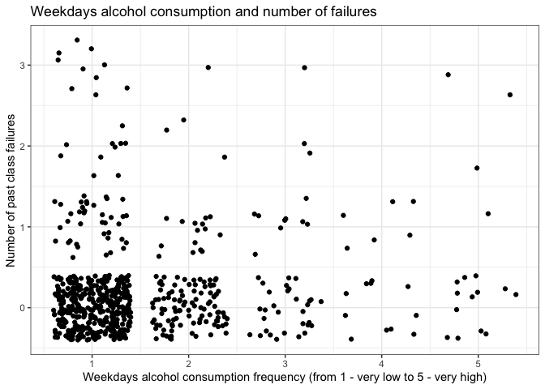
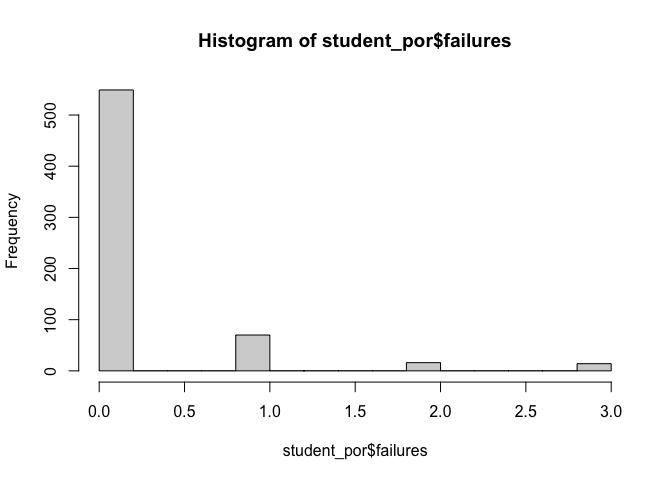
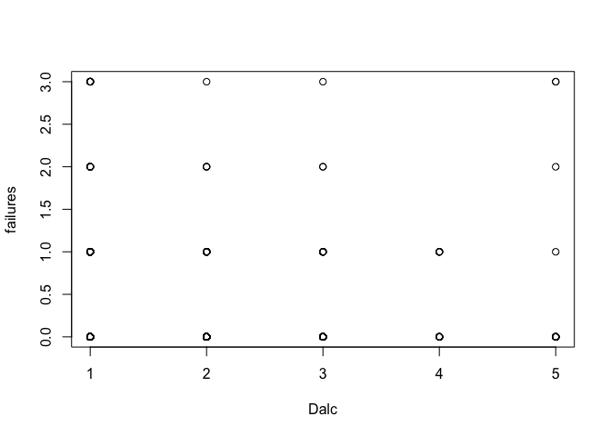

(W8) Linear Model
================
Elisa Simon
2022-08-31

# Dataset: Student Alcohol Consumption

The data set contains information concerning alcohol consumption,
sociodemographic status, and school-related topics (source: Ortiz
(2016))

# Research questions and variables of interest

In this report, I aim to know whether there is a (causal) relationship
between alcohol consumption on the weekdays and the number of failures
one experiments in his study journey.

-   **H1**: There is a correlation between weekdays alcohol consumption
    and the number of failures.
-   **H2**: The number of failures can be predict based on weekday
    alcohol consumption.

## Variables of interest

**Explanatory variable** : Dalc - weekdays alcohol consumption

-   numeric / quantitative discrete
-   (from 1 - very low, to 5 - very high)

**Response variable** : failures - absolute number of past class
failures

-   numeric / quantitative discrete

# Statistical investigations

## Are weekday alcohol consumption and number of failures correlated ?

First, we can look graphically if there’s an evident correlation between
the two variables

<!-- -->

Visually, it looks like there is a concentration of people that don’t
fail nor drink on weekdays. But, the correlation is not evident.
Therefore, we should now run a correlation’s test. As at least one of
the variables is not continuous, we should use the Spearman’s
correlation test.

    ## 
    ##  Spearman's rank correlation rho
    ## 
    ## data:  student_por$Dalc and student_por$failures
    ## S = 40600081, p-value = 0.0055
    ## alternative hypothesis: true rho is not equal to 0
    ## sample estimates:
    ##       rho 
    ## 0.1088617

The Spearman’s correlation test suggests that

-   There is a (weak) positive correlation between alcohol consumption
    and the number of failures (rho = 0.1088617)
-   The test is significant: the true correlation is not equal to 0
    (p-value = 0.0055)

For now, we cannot say that the correlation imply a causation.

### Linear regression failures \~ Dalc =\> Assumptions

**Independence of observations**: we don’t care because we only have one
explanatory and one response variables.

**Normality** of the dependent variable can be checked with an
histogram.

<!-- -->

Well, according to the histogram, we cannot use a Linear regression
model. Let’s run a shapiro test of normality just to be sure.

The Shapiro-Wilk normality test also suggests a non normal distribution
(p-value \< 2.2e-16).

However, the **linearity** or monotonicity of the relationship is also
not evident, as we can see:

<!-- -->

So unfortunately, our data cannot be linearly modeled.

# References

Ortiz, Jonathan. 2016. “Student Alcohol Consumption.”
<https://data.world/databeats/student-alcohol-consumption>.

